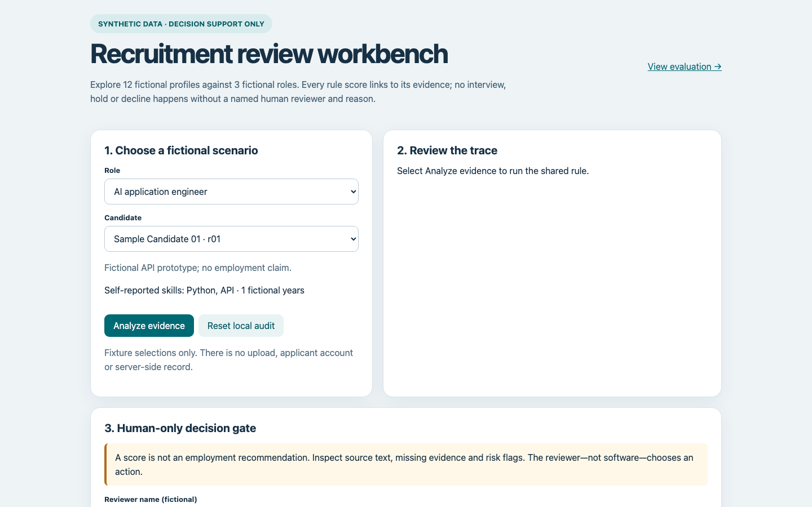

# AI Recruitment Workflow Demo

A synthetic recruitment-review workbench that traces rule scores to evidence and requires a human decision for every candidate.

**LIVE_DEMO / SYNTHETIC CANDIDATES** · [Try the workbench](https://zhouey314-cloud.github.io/ai-recruitment-workflow-demo/) · [Case study](docs/case-study.md) · [Resume bullets](docs/resume-bullets.md) · [Interview notes](docs/interview-notes.md)

The screenshot shows the deployed workbench's initial state, using fictional data. The demo contains 12 fictional resumes and 3 fictional jobs; the rule trace appears after **Analyze evidence**.

## Demo / quick start

Live interactive fictional workbench: <https://zhouey314-cloud.github.io/ai-recruitment-workflow-demo/>. [Browser eval replay](https://zhouey314-cloud.github.io/ai-recruitment-workflow-demo/eval/) shows the synthetic fixture results. The browser reads the same fixture data and rule configuration as Python; CI checks parity across all 36 combinations. There is no HR integration or real candidate data.

Python 3.10+: `python3 recruitment.py`; `python3 evals/run.py`; `python3 -m unittest discover -s tests`; `node tests/parity.mjs` after generating the Python report. Serve the repository root with `python3 -m http.server 8000` and open `http://localhost:8000/` for the browser demo. Output is `output/report.json` with 36 comparisons. The interactive audit is only in browser localStorage and can be reset; it is not secure persistence.

## Problem and architecture

Job → structured resume parse → cited skill evidence → simple rule score → `HUMAN_REVIEW` → recorded interview/hold/decline → audit. Every decision remains a human action. Self-reported skills with no evidence receive no points. [Scoring rubric and failure examples](docs/architecture.md) explain the boundary.

## Eval / verification

Thirteen Python unit tests, five synthetic fixture checks and 36 Python/browser parity checks cover evidence trace, unsupported claims, conflict flags and human gating. These validate deterministic mechanics only. `synthetic_unverified` is not a measured hiring outcome or a bias/fairness claim. No LLM provider runs. No real candidates or HR platform data. See [eval specification](evals/PROJECT_EVAL_SPEC.md), [resume bullets](docs/resume-bullets.md) and [interview notes](docs/interview-notes.md).

## Status / limitations / privacy

`IMPLEMENTED_AND_TESTED`: parser contract, evidence rubric, trace, browser workbench, local human gate and browser-only audit. `MOCK`: all fictional records and reviewer inputs. `DEPLOYED_STATIC_APP`: GitHub Pages hosts the interactive browser demo, not a secure backend. `NOT_IMPLEMENTED`: real parsing, model, fairness assessment, authenticated reviewer, tamper-proof audit and HR integration. Never use the score to automatically hire or reject a real person.

## License

[MIT](LICENSE).
