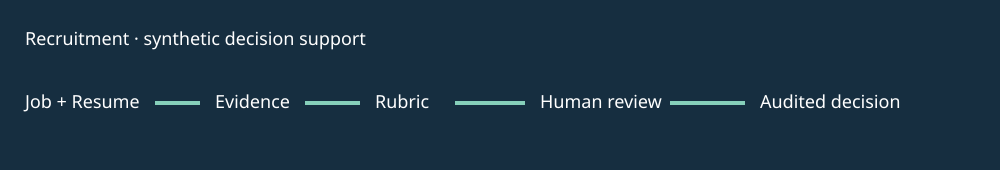

# AI Recruitment Workflow Demo

Synthetic decision support: 12 fictional resumes, 3 fictional jobs, evidence extraction, rubric scoring and a mandatory human decision gate.

## Demo / quick start

Python 3.10+: `python3 recruitment.py`; `python3 evals/run.py`; `python3 -m unittest discover -s tests`. Open `web/index.html` for an illustrative human review screen. Output is `output/report.json` with 36 comparisons.

## Problem and architecture

Job → structured resume parse → cited skill evidence → simple rule score → `HUMAN_REVIEW` → recorded interview/hold/decline → audit. Every decision remains a human action. Self-reported skills with no evidence receive no points. [Scoring rubric and failure examples](docs/architecture.md) explain the boundary.

## Eval / verification

Nine unit tests and five synthetic fixture checks cover evidence trace, unsupported claims and human gating. These validate deterministic mechanics only. `synthetic_unverified` is not a measured hiring outcome or a bias/fairness claim. No LLM provider runs. No real candidates or HR platform data. See [resume bullets](docs/resume-bullets.md) and [interview notes](docs/interview-notes.md).

## Status / limitations / privacy

`IMPLEMENTED_AND_TESTED`: parser contract, evidence rubric, trace, gate and audit. `MOCK`: fictional records and static review screen. `NOT_IMPLEMENTED`: real parsing, model, fairness assessment, authenticated reviewer, HR integration and deployment. Never use the score to automatically hire or reject a real person. MIT.
